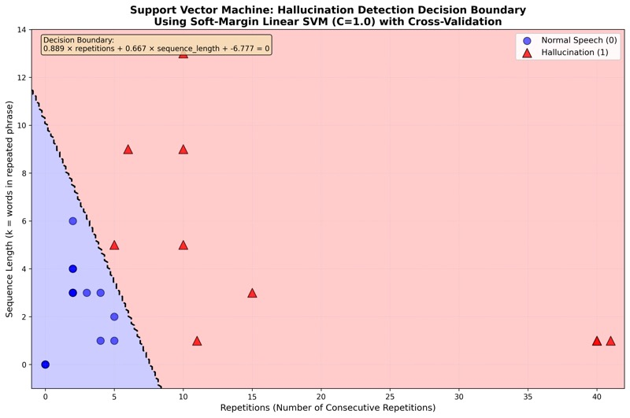

# Batch Transcribe Audio Files using MLX Whisper on Apple Silicon

This project uses [MLX Whisper](https://github.com/ml-explore/mlx-examples/tree/main/whisper), Apple's MLX framework implementation of OpenAI's Whisper model, to transcribe audio and video files on Apple Silicon (M1 or later) Macs. It is optimized for high-performance local inference using the Mac's built-in GPU and requires no cloud services.

To reduce hallucinations, silence is automatically removed from audio before transcription, with SRT timestamps reconstructed back to the original timeline. A custom-trained SVM classifier then detects and cleans any remaining hallucinations from the transcripts.

Audio and video files are organized into category folders (e.g., by source, channel, or topic), and the transcription workflow handles audio conversion, silence removal, batch processing, and output management automatically.

---

## Project Structure

```bash
.
├── justfile
├── README.md
├── pyproject.toml
├── scripts/
│   ├── prepare_audio.sh          # Convert media to WAV + remove silence
│   ├── generate_silence_map.py   # Generate silence_map.json from FFmpeg log
│   ├── transcribe.sh             # Batch transcribe WAV files
│   ├── remap_srt_timestamps.py   # Remap SRT timestamps to original timeline
│   └── clean_transcripts.py      # Remove hallucinations from transcripts
├── tests/
│   ├── fixtures/
│   │   └── test_with_silence.mp4 # Synthetic test audio (speech + silence gaps)
│   └── test_e2e.sh               # End-to-end pipeline test
└── data/
    ├── input/              # Source media files organized by category
    │   ├── category1/
    │   ├── category2/
    │   └── ...
    └── output/             # Generated files organized by category
        ├── category1/
        │   ├── wav/                    # Converted audio files (silence removed)
        │   │   ├── file.wav
        │   │   └── file.silence_map.json  # Timestamp mapping for reconstruction
        │   ├── transcripts/
        │   │   ├── tiny/
        │   │   ├── medium/             # .txt and .srt files (original timestamps)
        │   │   └── large/
        │   └── transcripts_cleaned/    # Hallucination-cleaned transcripts
        │       ├── tiny/
        │       ├── medium/
        │       └── large/
        └── ...
```

- `justfile`: Automation targets for dependency setup, audio preparation, and transcription with different models.
- `pyproject.toml`: Python project configuration with MLX Whisper dependency.
- `scripts/prepare_audio.sh`: Converts media files to WAV format (16kHz, mono, 16-bit PCM) with automatic silence removal and silence map generation.
- `scripts/generate_silence_map.py`: Parses FFmpeg silence detection log and generates `silence_map.json` for timestamp reconstruction.
- `scripts/transcribe.sh`: Batch transcribes WAV files using MLX Whisper models, generates `.txt` and `.srt` files, and remaps SRT timestamps to the original audio timeline.
- `scripts/remap_srt_timestamps.py`: Remaps SRT timestamps from silence-removed audio back to the original audio timeline using `silence_map.json`.
- `scripts/clean_transcripts.py`: Removes hallucinations (repetitive patterns) from transcripts.
- `data/input/`: Place your media files here, organized into category subfolders.
- `data/output/`: Generated WAV files, silence maps, and transcripts are stored here, organized by category and model.

---

## Whisper Models Available

Models are automatically downloaded from HuggingFace when first used. Choose the model that best fits your needs:

| Model | Speed | Language Support | Quality | HuggingFace Repo |
|-------|-------|------------------|---------|------------------|
| **tiny** | Fastest | Multilingual | Basic | mlx-community/whisper-tiny |
| **tiny-en** | Fastest | English only | Basic | mlx-community/whisper-tiny |
| **medium** | Balanced | Multilingual | Good | mlx-community/whisper-medium-mlx |
| **medium-en** | Balanced | English only | Good | mlx-community/whisper-medium-mlx |
| **large** | Slowest | Multilingual | Best | mlx-community/whisper-large-v3-mlx |

---

## Prerequisites

- **macOS with Apple Silicon** (M1 or later)
- **just** command runner ([installation instructions](https://github.com/casey/just#installation))
  ```bash
  brew install just
  ```
- **UV package manager** ([installation instructions](https://docs.astral.sh/uv/getting-started/installation/))
  ```bash
  curl -LsSf https://astral.sh/uv/install.sh | sh
  ```
- **FFmpeg** for audio conversion:
  ```bash
  brew install ffmpeg
  ```

---

## Usage

### 1. Install Dependencies

First, install the required Python dependencies:

```bash
just init
```

This runs `uv sync` to set up the Python environment with MLX Whisper.

### 2. Add Media Files

Organize your media files into category folders inside `data/input/`:

```bash
mkdir -p data/input/my-podcasts
cp /path/to/episode1.mp4 data/input/my-podcasts/
cp /path/to/episode2.m4a data/input/my-podcasts/
```

Supported formats: `.mp4`, `.wav`, `.webm`, `.m4a`, `.mov`, `.m4v`, `.mp3`, `.ogg`

### 3. Prepare Audio Files

Convert all media files to WAV format (required by Whisper):

```bash
just prepare
```

This will:
- Scan all category folders in `data/input/`
- Convert media files to 16kHz mono WAV format
- **Remove silence** from audio using FFmpeg's `silencedetect` filter (enabled by default)
- Generate a `silence_map.json` alongside each WAV for timestamp reconstruction
- Save converted files to `data/output/[category]/wav/`
- Skip files that are already converted (idempotent)
- Use multi-threaded FFmpeg for optimal performance

To disable silence removal:

```bash
just prepare REMOVE_SILENCE=false
```

### 4. Transcribe with Your Chosen Model

Run transcription with one of the available models:

```bash
just tiny       # Fastest, multilingual
just tiny-en    # Fastest, English-only
just medium     # Balanced, multilingual
just medium-en  # Balanced, English-only
just large      # Best quality, multilingual
```

This will:
- Process all WAV files in `data/output/*/wav/`
- Download the model from HuggingFace if not cached
- Transcribe each file using MLX Whisper
- Generate `.txt` and `.srt` transcript files
- **Remap SRT timestamps** to the original audio timeline (if silence was removed)
- Save transcripts to `data/output/[category]/transcripts/[model]/`
- Skip files that are already transcribed (idempotent)

### 5. Clean Transcripts (Optional)

Whisper can sometimes produce hallucinations - repetitive phrases that weren't in the original audio. This typically happens during silence or low-quality audio segments. To detect and remove these hallucinations:

```bash
just clean-transcripts
```

This will:
- Scan all SRT files in `data/output/*/transcripts/*/`
- Detect hallucinations using a suffix array algorithm and SVM classifier
- Remove repetitive patterns while preserving timestamps
- Save cleaned files to `data/output/[category]/transcripts_cleaned/[model]/`
- Generate both `.srt` (with timestamps) and `.txt` (plain text) files

To clean transcripts for a specific model only:

```bash
just clean-transcripts medium-en
```

For verbose output showing detected hallucinations:

```bash
just clean-transcripts "" true
```

**Note**: The hallucination detector uses a machine learning classifier trained on transcription patterns. It focuses on consecutive repetitions of phrases (3+ words repeated 5+ times). Single-word repetitions like "Okay. Okay. Okay." may not be flagged as they can occur in natural speech.

### 6. Run Tests

Run the end-to-end pipeline test to verify everything works:

```bash
just test
```

This runs the full pipeline (prepare → transcribe → clean) on a synthetic test audio file with 3 speech segments separated by silence gaps. It verifies that:
- WAV conversion and silence removal work correctly
- `silence_map.json` is generated with the correct segment structure
- Only `.txt` and `.srt` transcript formats are produced
- SRT timestamps are remapped to the original audio timeline (not the silence-removed timeline)
- Cleaned transcript files are generated

### 7. Check Progress

Monitor transcription progress across all categories and models:

```bash
just status
```

This will display:
- Input file counts for each category
- WAV file conversion progress
- Transcription progress for each model independently
- Categories sorted by average progress across all models
- Only shows models that have been run (have transcript directories)

Example output:
```
Category: my-podcasts
  Input files:  10
  WAV files:    10

  tiny-en   :   8 transcripts ( 80%)
  medium-en :   5 transcripts ( 50%)

Category: interviews
  Input files:   5
  WAV files:     5

  medium-en :   2 transcripts ( 40%)
```

### 8. View Transcripts

After transcription (and optional cleaning), you will find your transcripts organized by category and model:

```bash
# Original transcripts
data/output/my-podcasts/transcripts/medium/episode1.txt
data/output/my-podcasts/transcripts/medium/episode1.srt

# Cleaned transcripts (after running clean-transcripts)
data/output/my-podcasts/transcripts_cleaned/medium/episode1.txt
data/output/my-podcasts/transcripts_cleaned/medium/episode1.srt
```

---

## Silence Removal and Timestamp Reconstruction

By default, `just prepare` removes silence from audio files before transcription. This improves transcription quality by eliminating long silent gaps that can cause Whisper to hallucinate.

**How it works:**

1. **Pass 1**: Converts media to WAV while detecting silence intervals using FFmpeg's `silencedetect` filter
2. **Silence map**: Generates `silence_map.json` with a bidirectional mapping between trimmed and original audio timestamps
3. **Pass 2**: Extracts only speech segments using FFmpeg's `aselect` filter
4. **After transcription**: `remap_srt_timestamps.py` uses the silence map to convert SRT timestamps back to the original audio timeline

**Silence detection parameters** (configurable via environment variables):

| Parameter | Default | Description |
|-----------|---------|-------------|
| `SILENCE_THRESHOLD_DB` | -40 | Silence threshold in dB. More negative = only very quiet sounds treated as silence. |
| `SILENCE_MIN_DURATION` | 1 | Minimum silence duration in seconds before removal. |

```bash
# More aggressive silence removal
SILENCE_THRESHOLD_DB=-30 SILENCE_MIN_DURATION=0.5 just prepare

# More conservative silence removal
SILENCE_THRESHOLD_DB=-50 SILENCE_MIN_DURATION=2 just prepare
```

**Silence map JSON format:**

```json
{
  "version": "1.0",
  "source_file": "episode1.mp4",
  "audio_duration_original_seconds": 3600.5,
  "audio_duration_trimmed_seconds": 3200.3,
  "silence_threshold_db": -40.0,
  "silence_min_duration_seconds": 1.0,
  "kept_segments": [
    {"trimmed_start": 0.0, "trimmed_end": 120.5, "original_start": 0.0, "original_end": 120.5},
    {"trimmed_start": 120.5, "trimmed_end": 335.3, "original_start": 125.3, "original_end": 340.1}
  ]
}
```

---

## Example Workflow

```bash
# Install dependencies
just init

# Add your media files
mkdir -p data/input/interviews
cp interview1.mp4 data/input/interviews/
cp interview2.m4a data/input/interviews/

# Convert to WAV (with silence removal)
just prepare

# Transcribe with medium model (good balance of speed and quality)
just medium

# Clean transcripts (remove hallucinations)
just clean-transcripts

# Check progress
just status

# View results (use cleaned version if available)
cat data/output/interviews/transcripts_cleaned/medium/interview1.txt
```

---

## Tuning Hallucination Detection

The hallucination detection in `scripts/clean_transcripts.py` uses a two-stage approach:

1. **Pattern Detection**: A suffix array algorithm finds consecutive repetitions in the transcript text
2. **Classification**: A Support Vector Machine (SVM) classifier determines if a repetition is a hallucination or natural speech

#### Pattern Detection

The following parameters control the pattern detection stage and can be adjusted at the top of `scripts/clean_transcripts.py`:

| Parameter | Default | Description |
|-----------|---------|-------------|
| `MIN_K` | 1 | Minimum phrase length in words. A value of 3 means only phrases of 3+ words are considered. |
| `MIN_REPETITIONS` | 5 | Minimum consecutive repetitions required before checking the classifier. |
| `MIN_WINDOW_SIZE` | 500 | Sliding window size in words for processing long transcripts. |
| `OVERLAP_PERCENT` | 25.0 | Overlap between sliding windows (0-100). |

#### SVM Classifier

The classifier uses a linear SVM with two features:
- **repetitions** (n): How many times the phrase repeats consecutively
- **sequence_length** (k): How many words are in the repeated phrase

The decision function is:

```
score = (coef_repetitions × n) + (coef_sequence_length × k) + intercept
```

With the default coefficients:
- `coef_repetitions = 0.8888`
- `coef_sequence_length = 0.6665`
- `intercept = -6.777`

A pattern is classified as a **hallucination** if `score > 0`.

#### How Parameters Affect Classification

The decision boundary visualization shows how the SVM separates normal speech (blue region) from hallucinations (pink region):



**Examples with default coefficients:**

| Phrase Length (k) | Repetitions (n) | Score | Classification |
|-------------------|-----------------|-------|----------------|
| 1 word | 6 times | -0.78 | Normal (not hallucination) |
| 1 word | 8 times | 0.99 | Hallucination |
| 3 words | 5 times | 0.11 | Hallucination |
| 5 words | 3 times | -0.78 | Normal |
| 5 words | 5 times | 0.99 | Hallucination |

**Key insights:**

- Single-word repetitions need 7+ occurrences to be flagged
- Longer phrases (3+ words) are flagged more easily
- The classifier was trained to distinguish natural speech patterns ("you know, you know") from true hallucinations

#### Adjusting for Your Use Case

**More aggressive detection** (catches more hallucinations, may have false positives):

- Lower `MIN_REPETITIONS` to 3 or 4
- Lower `MIN_K` to 1 (already default)
- Adjust `intercept` to a more negative value (e.g., -7.5)

**More conservative detection** (fewer false positives, may miss some hallucinations):

- Raise `MIN_REPETITIONS` to 6 or 7
- Raise `MIN_K` to 3 (ignores single/double word patterns)
- Adjust `intercept` to a less negative value (e.g., -6.0)

---

## Performance Notes

- **MLX Optimization**: MLX is specifically optimized for Apple Silicon, providing excellent performance without requiring external GPUs.
- **Multi-threading**: Audio conversion uses all available CPU cores automatically.
- **Model Caching**: Models are downloaded once and cached locally in `~/.cache/huggingface/`.
- **Idempotent Operations**: Scripts skip already-processed files, making it safe to re-run commands.
- **Memory Usage**: Larger models require more RAM. The `large` model may need 16GB+ RAM for long audio files.

---

## Troubleshooting

### No transcripts generated?

- Check that WAV files exist in `data/output/[category]/wav/`
- Verify `just prepare` completed successfully
- Ensure you have enough disk space and RAM

### Audio conversion failed?

- Verify FFmpeg is installed: `ffmpeg -version`
- Check that input files are valid media files
- Look for error messages during `just prepare`

### Model download failed?

- Check your internet connection
- Verify you have enough disk space (~1-3GB per model)
- Models are cached in `~/.cache/huggingface/hub/`

### "UV not found" error?

Install UV package manager:
```bash
curl -LsSf https://astral.sh/uv/install.sh | sh
```

### Hallucinations not detected?

- The detector may not catch all repetitive patterns depending on phrase length and repetition count
- See the [Tuning Hallucination Detection](#tuning-hallucination-detection) section to adjust parameters for your use case

### Transcription is too slow?

- Use a smaller model (`tiny` or `medium` instead of `large`)
- Process shorter audio segments
- Ensure no other intensive tasks are running

---

## File Organization Tips

Recommended category naming conventions:

```bash
data/input/
├── @ChannelName/          # YouTube channels
├── ProjectName/            # Project recordings
├── 2024-Q1-Meetings/      # Time-based organization
└── InterviewSeries/        # Content series
```

This keeps transcripts well-organized in `data/output/` with the same structure.

---

## Notes

- **Privacy-focused**: All processing happens locally on your Mac. No cloud services or API calls (except for model downloads).
- **Category-based organization**: Unlike model-based routing, this system organizes by content source/category.
- **Two-stage workflow**: Separate audio preparation and transcription allows you to prepare once, then try different models.
- **Output formats**: Generates `.txt` (plain text) and `.srt` (with timestamps) transcript files.
- **Apple Silicon only**: This project requires Apple Silicon (M1 or later). For Intel Macs or other platforms, use [whisper.cpp](https://github.com/ggerganov/whisper.cpp) instead.

---

## Related Projects

- For GPU-accelerated transcription on NVIDIA GPUs: [batch-transcribe-with-whisper-local-gpu](https://github.com/florianbuetow/batch-transcribe-with-whisper-local-gpu)
- For CPU-based Docker transcription: [batch-transcribe-with-whispercpp-local-cpu](https://github.com/florianbuetow/batch-transcribe-with-whispercpp-local-cpu)

---

## License

This project structure and scripts are provided as-is for batch transcription workflows using MLX Whisper on Apple Silicon.
